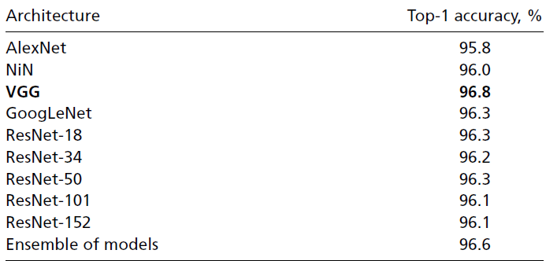
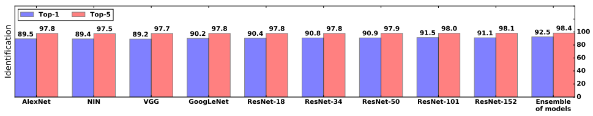

# Automatically identifying, counting, and describing wild animals in camera-trap images with deep learning

- [Automatically identifying, counting, and describing wild animals in camera-trap images with deep learning](#automatically-identifying-counting-and-describing-wild-animals-in-camera-trap-images-with-deep-learning)
  - [Problem](#problem)
    - [Snapshot Serengeti (SS) Project](#snapshot-serengeti-ss-project)
  - [Current Work](#current-work)
  - [Datasets](#datasets)
  - [Architectures](#architectures)
  - [Tasks](#tasks)
      - [Task 1 (Binary Classification: Empty vs. Non-Empty)](#task-1-binary-classification-empty-vs-non-empty)
      - [Task 2 (Multiclass Classficiation: Identifying Animals)](#task-2-multiclass-classficiation-identifying-animals)
      - [~~Task 3 (Counting Animals)~~](#stask-3-counting-animalss)
      - [~~Task 4 (Additional Attributes)~~](#stask-4-additional-attributess)
  - [Experiments](#experiments)
    - [Results](#results)
  - [Conclusions](#conclusions)

## Problem

To better understand the complexities of natural ecosystems and better manage and protect them it would be helpful to have detailed, large-scale knowledge about the number, location, and behaviors of animals in the natural ecosystems. 

Currently, we use motion sensor cameras in natural habitats to assist with this task. These cameras take millions of images but the task of labelling these images, categorizing animals remain a hard task. Human volunteers have to manually go through each image and classify it as an animal or empty. This is very time-consuming and results in errors. 

In the **Snapshot Serengeti (SS)** project where a huge volunteer force was harnessed to label these images, the human volunteer specials and count labels are estimated to be 96.6% and 90.0% accuracte respectively.

### Snapshot Serengeti (SS) Project

The world's largest camera-trap project published to date, SS has 225 camera traps running continuously in *Serengeti National Park, Tanzania*. 

For this project, 28,000 registered and 40,000 unregistered volunteer have labeled 1.2 million SS capture events. 

For each image set, multiple users label the species, number of individuals, various behaviours, and the presence of young.

## Current Work

For the current paper, the main focus was on the capture events that contain **only one species**. All the other capture events and images were removed from the dataset. This was around 1.2% per the events. 

It was found that **75%** of the capture events were classified as empty for animals. Also, the volunteers labelled the entire capture event rather than individual images. The main experiments for this research identify individual images rather than the entire event.

## Datasets

The dataset used for this research is the [Snapshot Serengeti Dataset](http://lila.science/datasets/snapshot-serengeti). This dataset contained 1.4 million images with a total of 301,400 capture events *(set of images in a single motion capture trap)*

The dataset consists of 48 different species spread across the Serengeti National Park. 

In this dataset, 25% of images are labelled as non-empty *(containing animals)* by the human-volunteers. 

To overcome the issue of overfitting where the model just memorizes the examples in the training and testing set, the entire capture event, containing 3 images each, was put in either training or test set. 

Out of the 301,400 capture events 284,400 random capture events were put in the training set and rest in the testing set. There was another testing set that was labelled by the expert scientist and was used as a gold-standard in testing for all the models. This testing set contained 3,800 capture events.

## Architectures

Nine different architectures were tested to find the highest-performing networks. Each model was only trained one time because it is computationally expensive. Also, it is theoretically and empirically suggested that different Deep Neural Networks trained with the same architecture but initialized differently, often converge to similar performance levels. 

The following architectures were used:
<pre>
- AlexNet:    (Num layers 8)
- VGG:        (Num layers 22)
- NiN:        (Num layers 16)
- GoogLeNet:  (Num layers 32)
- ResNet:     (Num layers 18)
- ResNet:     (Num layers 34)
- ResNet:     (Num layers 50)
- ResNet:     (Num layers 101)
- ResNet:     (Num layers 152)
</pre>

## Tasks

This research is divided into multiple tasks and each task has a separate goal that was later combined to automate the camera-trap image labelling task for the Serengeti Dataset.

#### Task 1 (Binary Classification: Empty vs. Non-Empty)
In this task, a single model was trained to detect if the image contains an animal or not. Since it was initially noted that 75% of the images were empty, automating this task meant that the human labor was reduced by 75%. 

#### Task 2 (Multiclass Classficiation: Identifying Animals)
In this task, multiple single models and an ensemble of models was trained to classify images as one of the 48 different species in the Serengeti Dataset. 

#### ~~Task 3 (Counting Animals)~~

> **Not in the current scope**

#### ~~Task 4 (Additional Attributes)~~
> **Not in the current scope**

## Experiments

Given the tasks above, the experiments showed that a **two-staged pipeline** outperformed a **one-step** pipeline.

The first stage was solving the binary classification task. This was the Task 1. All the 25% of non-empty images were taken. These were 757,000 images and from the 75% of empty images, the same amount of images were selected randomly. 

The training set for this task contained 1.4 million images and the test set contained 105,000 images. 

> SS dataset contains labels for capture events so all the images in a single capture event were assigned the same label. 

**VGG model achieved the best accuracy of 96.8%**

---

In the second stage, most of the information-extraction was done. This stage included three tasks, namely identifying animals, counting animals and additional attributed. One model was trained to simultaneously perform all of these three tasks. This technique is popularly called *Multi-task Learning*. 

The reason for doing this, was since these three tasks are related, they can share weights that encode features common to all tasks. This technique also requires fewer model parameters vs. a separate model for each task. This allows that all the tasks can be solved faster with more efficiency. 

For identifying animals, the corresponding output layer produced the probabilities of the input image being one of the 48 possible species. Top-1 and Top-5 accuracies were reported for this task. 

> **Top-5** accuracy is useful for this research as it can help reduce the human labor effort in classifying the animal species.

The models were tested on the expert-labeled test set and the *model ensemble* had 94.9% top-1 and 99.1% top-5 accuracy. 

On the volunteer labelled test set the accuracies were reported in the graph below.

**Resnet 152 was the best single model in this test set**.

### Results

Two-staged pipeline was created where the VGG model was first used to classify whether the image had an animal present or not. If there was an animal present then, the image was passed through the ensemble model to classify the species of the animal and other tasks. 

The authors reported that for Task 1, detecting images that contain animals, expert-provided labels were not present and thus did not know the accuracy of the human volunteers. This was assumed to be same 96.6% accuracy as on the species identification tasks by human volunteers. 

Since VGG performed better than the volunteers' accuracy, it was assumed that the 75% of empty image labelling was achieved with an 100% confidence. 

For Task 2, identifying species, the confidence threshold was set at 43% so the emsemble model was able to automatically process 97.2% of the remaning non-empty images (25% of data) at human-level accuracy. 

The total accuracy of 96.6% of this pipeline of automating labelling was achieved for 

> (75% X 100%) *binary* + (25% X 97.2%) *multiclass* = 99.3% 

of the data.

## Conclusions

This paper shows that we can automate the task of labelling animal species from camera trap images in a large dataset. This paper shows that we can do this process efficiently and help reduce the manual labor and hours by human volunteers. 

The system created by the authors can save 99.3% of the manual labor on animal identification task. This is great than **17,000** hours of work put by manual levels. The paper also shows that this system can not only help save the time, but also do this task at the same human-level accuracy of 96.6%.

