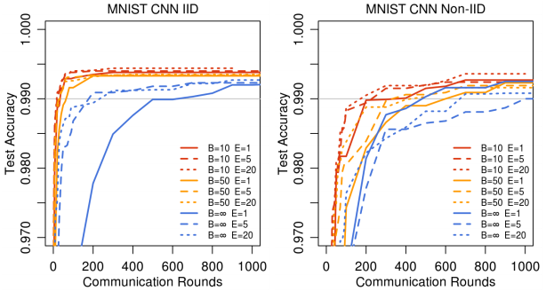

# Communication-Efficient Learning of Deep Netowkrs from Decentralized Data

## Problem

Modern devices have a wealth of data that can allow great learning for models. This can provide a great and personal user-experience. 

While this data is great, there is a big issue of user privacy if this data leaves their devices. We have seen that anonymizing the data is not enough to maintain user privacy from the [Netflix Prize Competition Dataset](https://arxiv.org/PS_cache/cs/pdf/0610/0610105v2.pdf "Robust De-anonymization of Large Datasets (How to Break Anonymity of the Netflix Prize Dataset)"). 

Apart from the privacy issue, this data is often very large in quantity which will require a large amount of space in the data center and then training the model. 

## Primary Contributions

1. The identification of problem of training on decentralized data from mobile devices. 
   
2. Selection of a straightforward and practival algorithm that can be applied to this setting.
3. Extensive empirical evaluation of the proposed approach.
   
## Algorithm/Solution

This paper advocates an alternative to the problems above by a new approach where the training data is left distributed on the devices. The global model rlearns by aggregating locally-computed updates. 

The paper labels this decentralized approach as **Federated Learning**. The name *Federated Learning* comes from the fact that the learning task is solved by a loose federation of participating devices (referred as clients). These clients are coordinated by a central server.

With this decentralized approach, this paper released a new algorithm labelled as **FederatedAveraging** which we will talk about more later.

### Federated Learning

The main idea of Federated Learning **(FL)** is the concept of keeping user data private. Even if the data in the data centers is "anonymized", it can still put the users at risk via join with other data. In FL, the information transmitted is the minimal update necessary to improve a particular model. The updates themselves don't contain extra information than what is actually required. The source of these updates can be transmitted of trusted third party without identifying the meta-data.

### Federated Optimization

Optimization problem in FL is referred to as Federated Optimization. The several key properties in Federated Optimization. For this paper, we will be focusing on two:

- **Non-IID** The training data on a given client is typically based on the udage of the mobile device by ap articular user, and hence any particular user's local dataset will note be representative of the population distribution.
- **Unbalanced** Some users will make much heavier use of the service or app than others, leading to varying amounts of local training data.

In the paper, the authors assume a synchronous update scheme that proceeds in the rounds of communication. It goes as follows

> There is a fixed set of K clients, each with a fixed local dataset. At the beginning of each round, a random fraction C of clients is selected, and the server sends the current global algorithm state to each of these clients. By only selecting a fraction of clients for efficiency, experiments show diminishing returns for adding more clients beyong a certain point. Each selected client then performs local computation based on teh global state and its local dataset, and sends and update to the server. **The server then applies these updates to tits global state, and the process repeats.**

The authors mentioned that although most of their focus is on non-convex neural network objectives, the algorithm is applicable to any finite-sum objective of the following form:

> 

In Machine Learning,  is the loss of the prediction on example  made with model parameters w.

For FL, we assume that there are **K** clients over with the data is partitioned. We have **P_k** as the set of indexes of data points on client **k**, with . Now we can update the above objective as:

>  where 

### The Federated Averaging Algorithm

#### FederatedSGD
In Federated Optimization, SGD can be applied naively, where a single batch gradient calculation (on a random client) is done per round of communication. In FL setting, there is a little cost in wall-clock time to involvinng more clients. To overcome this, the baseline algorithm used is referred as *FederatedSGD*. In this, **C** fraction of clients are selected on each round, and then the gradient fo the loss over all the data held by these clients is computed. **C** controls the *global* batch size, where **C=1** corresponds to non-stochastic gradient descent.

#### FederatedAveraging

In this algorithm, each client locally takes one steps of gradient descent on the current model using its local data, and the server then takes a weighted average of the resulting models. Once the algorithm is written this way, we can add more computation to each client by iterating the local update  multiple times before the averaging step.

The amount of computation is controlled by three parameters: 

- **C**, the graction of clients that perform computation on each round.
- **E**, the number of training passes each client makes over its local dataset on each round.
- **B**, the local minibatch size used for client updates.  indixares that the full local dataset is treated as a single minibatch.
  
> For  and **E=1**, this algorithm is equivalent to *FederatedSGD*.

##### Pseudocode

## Experiments

#### Datasets

Three datasets were used:

- MNIST Handwritten Digit Classification *(grayscale) - 1 channel*
- CIFAR10 Image Classification *(colored) - 3 channels*
- Shakespeare Language Modelling

> NOTE: We will be mostly focusing on the MNIST Digit Classification for this summary.

#### Models

For MNIST Classification task, two models were used, namely:

1. A simple multi-layer perceptron with 2 hiddent layers with 200 units each using ReLU activations.
2. A CNN with two 5X5 convolution layers , 32 and 64 channels respectively. Each of these layers were passed through Max Pooling layers of size 2X2.

#### Data Partitioning 

Two ways for paritioning data- 

1. IID (Independent and Identically Distributed)
   1. data is shuffled
   2. partitioned into 100 clients. Each client receives 600 examples

2. Non-IID
   1. Sort the data by digit label
   2. Divide it into 200 shards. Each shard is of size 300
   3. Assign each of 100 clients 2 shards.

    > Note here that this is pathological non-IID partition as most of the clients will only have examples of 2 digits from the dataset of 10 digits.

#### Hyperparameter Tuning

There are various techniques used in the paper to tune the hyperparameters.

- **Increasing Parallelism**: Multiple values for client fraction **C** (controls the amount of multi-client parallelism) was experimented with. A learning curve for each combination of parameter was constructed optimizing , between  and , and then making each curve monotonically impriving by taking the best value of test-set accuracy achieved over all prior rounds.

- **Increasing computation per client**: Here **C** is fixed to 0.1. More computations are added by either decreasing **B**, increasing **E**, or both. Adding more local SGD updates per round produces a dramatic decrease in communication costs as seen in the figure. The table below quantified these speedups. **It is noticed that increasing *u* by varying both *E* and *B* is effective**

- **Over-optimizing the client datasets**: From the pseudocode, we notice that the model parameters only influence the optimization performed in each *ClientUpdate* via initialization. As , for a convex problem, these initializations do not matter and *global minimum* is achieved anyways.

## Conclusions

Results show that Federated Learning can be practical with the new defined algorithm **Federated Averaging**. It outperforms *FederatedSGD* and is able to train high-quality models using relatively few rounds of communication.

> Entire paper can be found in arxiv linked here:  [Communication-Efficient Learning of Deep Networks
from Decentralized Data](https://arxiv.org/pdf/1602.05629.pdf)
