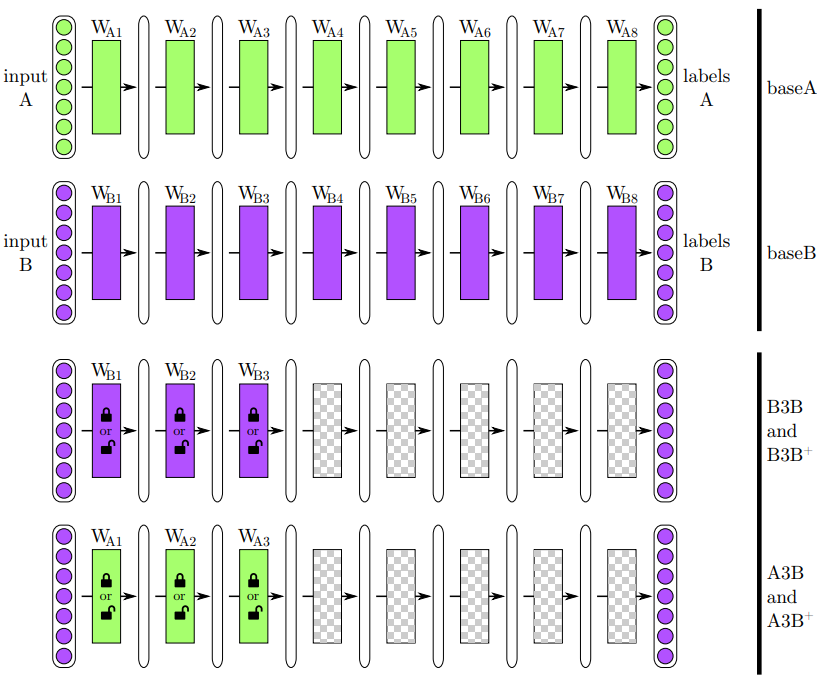
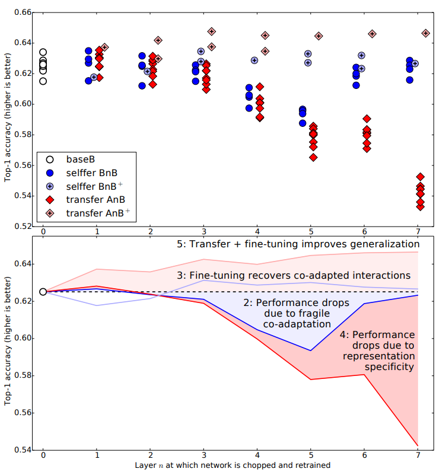
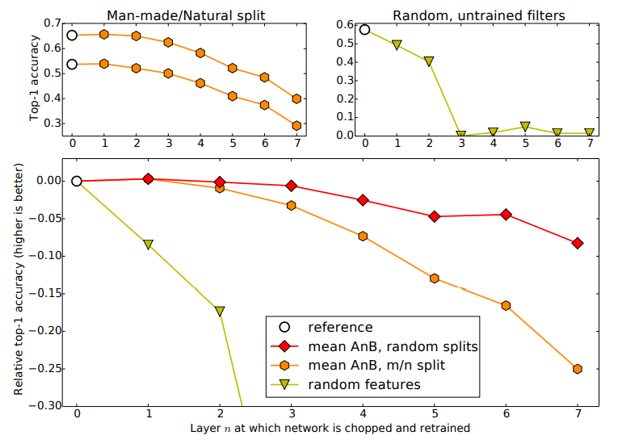

# How transferable are features in deep neural networks?

## Problem

Most of the DNN trained on natural images have the first layers always learning features similar to Gabor filters and color blobs. This kind of behavior is not specific to a particular dataset or task. 

We know that features must eventually transition from general to specific towards the end of the network. This transition of features hasn't been studied extensively. Hence, we still refer to the the neural networks as a **BLACK BOX**. 

## Primary Contributions

- Define a way to quantify the degree to which a particular layer is general or specific. 
- Show two separate issues that cause performance degradation when using transferred features without fine-tuning. 
- Quantify how the performane benefits of transferring features decreases the more dissimilar the base task and target task are.
- Initializing a network with transferred features from almost any number of layers can produce a boost to generalization performance after fine-tuning to a new dataset.

## Introduction

It is noticed that for any task from supervised image classification to unsupervised density learning, the first-layer features resemble either Gabor filters or color blobs. Usually these first-layer features are called *general* because of this exact reason above. 

On the other hand, the last layers of the model highly represent the particular task or dataset that it is trained on. Hence, these last layers are called *specific*. 

Now it is obvious that in our so called **BLACK BOX**, that is the neural network, this transition from *general* to *specific* takes place. Let's keep the following questions in our mind for now.

- Can we quantify the degree to which a particular layer is general or specific?
- Does the transition occur suddenly at a single layer, or is it spread out over several layers?
- Where does this transition tak place: near the first, middle, or the last layer of the network?

> Why are these questions important? If we can figure out the extent that features within a network are general, we will be able to use them for *transfer learning*.

### What is Transfer Learning?

First train a *base* network on a base dataset and task. Use these final weights and transfer them to a second *target* network to be trained on a different target dataset and task. If the features are general then this process works well. 

Having a target dataset that is significantly smaller than the base dataset, transfer learning can be a powerful tool to enable training a large target network without overfitting.

Usually, we take our trained base network and copy the first *n* layers to the first *n* layers of a target network. For the remaining layers of the target network, we just **randomly** initialize them and train them towards the target task. Now, you can either choose to backpropagate the errors from the new task to the copied weights to *fine-tune* on the new task or just *freeze* these first *n* layers of the target network. 

> It is noted that if the target dataset is small and the number of parameters is large, fine-tuning may result in overfitting, so the features are often left frozen. On the other hand, if the target dataset is large or the number of parameters is small, so that overfitting is not a problem, then the base features can be fine-tuned to the new task to improve performance.

**If the target dataset is very large, there would be little need to transfer because the lower level filters could just be learned from scratch on the target dataset.**

### ImageNet Data Splits

- **SIMILAR DATASETS**
    
    Randomly assign hald of the 1000 classes to task A and task B. ImageNet has clusters of similar classes. For example, from the biological family of *Felidae* {tabby cat, tiger cat, Persian cat, Siamese cat, Egyptian cat, mountain lion, lynx, leopard, snow leopard, jaguar, lion, tiger, cheetah}. 

    Since A and B will contain 6 or 7 of these classes on average, we can see that the networks will classify some kind of felids. If we want to transfer these weights to another dataset of felids, then we can expect the new high-level classes of felids trained on top of old low-level felids detectors to work well.

- **DISSIMILAR DATASETS**

    Since ImageNet also has the hierarchy of parent classes, task A and task B are created by taking two halves that are semantically different. Task A contained only *man-made* entities and task B contained only *natural* entities.

## Experiments

> Keeping the similarity of two datasets *A* and *B* in mind, let's define the degree of generability of a set of features learned on task A as the extenst to which the features can be used for another task B.

- Create non-overlapping task A and B by randomly splitting the 1000 ImageNet classes into groups containing 500 classes and ~645,000 examples each. **BaseA and BaseB**
- Train one 8-layer convolutional network on task A and another on task B.
- Choose layer *n* from {1,2,...,7} and train several new networks. For n=8, it will result in **BaseB**
- For *n = 3*,
  - *<ins>selffer network:</ins>* copy first 3 layers from **BaseB** and freeze them. Initialize the remaining layers randomly and train on task B. Control network for next transfer network. *(row 3 in figure below)*. **B3B**
  - *<ins>transfer network:</ins>* copy first 3 layers from **BaseA** and freeze them. the remaining layers are randomly initialized and trained on task B. Now, if the results from this are close or better than **BaseB**, then we can claim that the first 3 layers in task B are *general* otherwise they are *specific* to task A. *row 4 in the figure* **A3B**

> This process is repeated for all *n* in  and in both directions (AnB and BnA). 

> NOTE: The transferred layers are frozen for these networks. Other versions are created for fine-tuning transferred layers *A3B+* and *B3A+*.

## Results
We will use the following figure to define results in Similar datasets. 

#### Similar Dataset Results *(Figure Above)*

1. **baseB** is the network trained on random subset of 500 classes. 
      1. Top-1 Accuracy: 62.5%
      2. Error: 37.5%

2. **BnB Dark Blue** shows that transferability works well up till layer 2. On layers 3, 4, 5 and 6 have bad performance. This shows us that the particular layers contained fragile co-adapted features on successive layers. This co-adaption couldn't be relearned by the upper layers alone. By layer 6 and 7, performance is back to the normal and gradient descent is able to find a good solutions. As we get closer to the layer 8, where we don't have a lot to learn, it is simple enough for gradient descent to find a good solution. **Such optimization difficulties may be worse in the middle of the network than near the bottom or top.**

3. **BnB+ Light Blue** show that when the copied, lower-layer features also learn on the target dataset (which here is the same as the base dataset), performance is similar to the base case. Such fine-tuning thus prevents the performance drop observed in the BnB networks.

4. **AnB Dark Red** show the main results that we wanted to measure: the transferability of features from one network to another at each layer. We see here that the layers 1 and 2 trransfer almost perfectly. This shows us that for these two tasks A and B, that are similar, the first two layers can be specified as *general*. We then start seeing a drop in accuracy from layers 3 onwards. This is probably happening because of two issues: 
   1. The drop from lost co-adaption
   2. The features are more **specific** to the task B. 

    The issue 1 dominates for layers 3, 4 and 5, whereas on layers 6 and 7, the specificity of representation dominates the drop in performance.

5. **AnB+ Light Red** shows that transferring weights and fine-tuning them results in a network that generalizes better than those trained directly on the target dataset. Previously, transfering weights was done to reduce overfitting. This new result suggests that transferring in general boosts generalization performance even when the target dataset is **large**. 

    >  Note that this effect should not be attributed to the longer total training time (450k base iterations + 450k finetuned iterations for AnB+ vs. 450k for baseB), because the BnB+ networks are also trained for the same longer length of time and do not exhibit this same performance improvement.

    A plausible explanation is that even after 450k iterations of fine-tuning (beginning with completely random top layers), the effects of having seen the base dataset still linger, boosting generalization performance.

    The average boost across layers 1 to 7 is 1.6% over the base case, and the average if we keep at least five layers is 2.1%

#### Dissimilar Dataset Results *(Figure Below)*

The upper-left subplot of Figure shows the accuracy of a baseA and baseB network (white circles) and BnA and AnB networks (orange hexagons). Lines join common target tasks. The upper of the two lines contains those networks trained toward the target task containing natural categories (baseB
and AnB). These networks perform better than those trained toward the man-made categories, which
may be due to having only 449 classes instead of 551, or simply being an easier task, or both.

## Conclusions
- All the results come from experimentally quantifying the generality.
- Transferability is negatively affected by two issues.
  -  Optimization difficulties related to splitting networks in the middle of fragilely co-adapted layers.
  -  The specialization of higher layer features to the original task at the expense of performance on the target task.
- Either of these two issues may dominate, depending on whether features are transferred from the bottom, middle, or top of the network
- Transferability of features decreases as the distance between the base task and target task increases.
- Transferring weights from a distant task is better than using random weights.
- Initializing a network with transferred features from almost any number of layers ccan produce a boost to generalization.

> The full paper can be found at the NIPS link => [How Transferrable are features in Deep Neural Network](https://papers.nips.cc/paper/5347-how-transferable-are-features-in-deep-neural-networks.pdf)